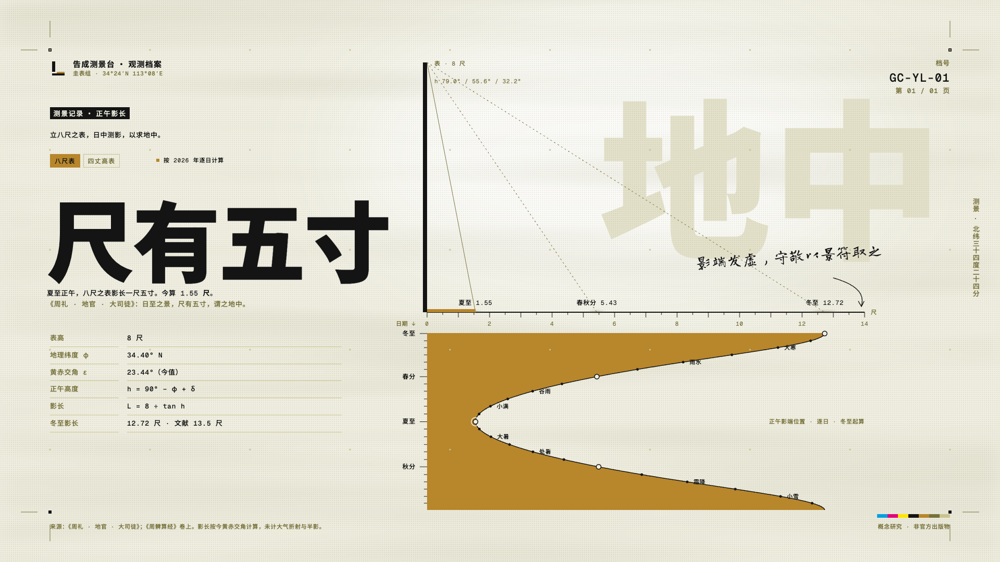
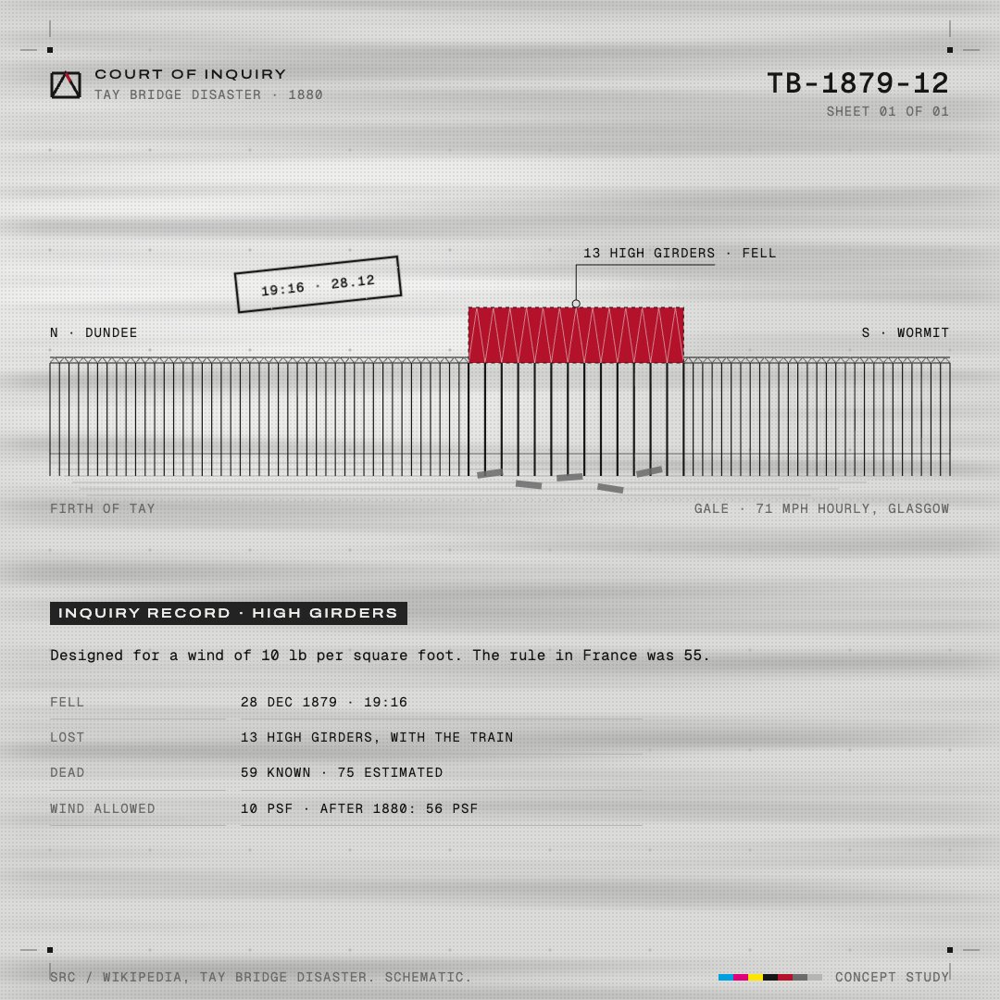

# Arknights Printer

An Agent Skill that turns a real subject (a measurement, a structure, an event) into a poster or information sheet in an industrial sci-fi style: each image is a document issued by an institution, with a visible grid, functional labels, small type, one brand color and plenty of empty space.

Unofficial fan project, not affiliated with Hypergryph. It keeps the style and none of the works.

[中文说明](README.zh-CN.md)

| | |
|---|---|
|  |  |

## Install

Copy `arknights-printer/` into your agent's skills folder (for Claude Code: `~/.claude/skills/`).

## Use

Ask for a sheet about a real subject, for example "a poster about the Tay Bridge collapse" or "做一张关于圭表测影的信息图". The skill asks at most four questions: format and size, issuing institution, dialect, information density (airy / standard / dense).

Works best for subjects with real data and one clear shape: a measurement, a cross-section, a route, a structure, a timeline of one event.

## Scripts

Python 3. `render_check.py` also needs Playwright.

```bash
python3 arknights-printer/scripts/bundle.py page.html -o output/page.html
python3 arknights-printer/scripts/render_check.py output/page.html --medium screen
```

`bundle.py` inlines CSS, JS and subsetted fonts into one file. `render_check.py` renders a PNG and reports fallback fonts, overflow, overlapping text, text below the minimum size and extra saturated colors.

## License

MIT
